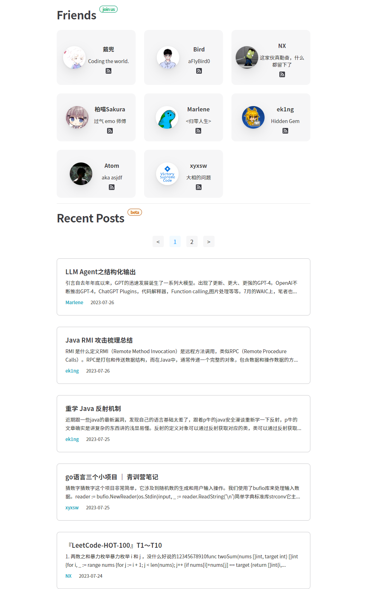

# HelloCTF-CTFerlink

本项目基于 https://github.com/NX-Official/friends-link-plus

原理为利用GithubAction定时抓取对应博客的RSS进行MarkDown的生成。

该项目会收集师傅们的博客，将内容分方向(Web MISC Crypto Re Pwn 等等)展示到[http://ctf.tj.cn](https://t.co/cHuCzDSgxk)的一个独立页面

效果可以参考杭电他们的wiki [https://cs.hdu.wiki/blog/](https://t.co/BOADbyc2Hm) 

感谢白夜师傅 [@h4kuy4](https://github.com/h4kuy4) 提供的建议

